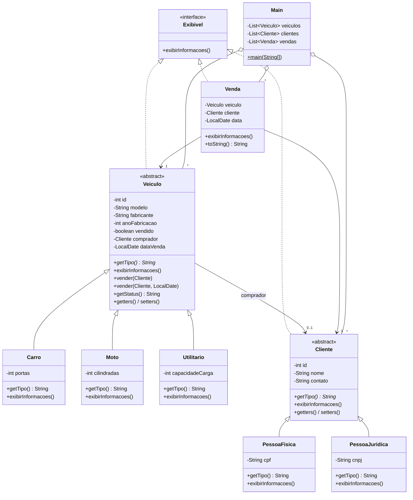
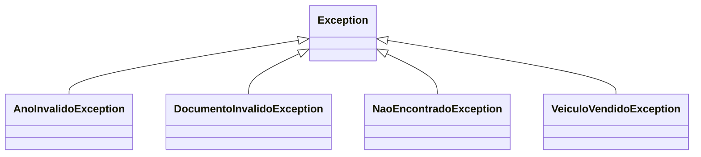

# Diagrama de Classes — Sistema de Concessionária

```mermaid
classDiagram
    direction TB

    class Exibivel {
        <<interface>>
        +exibirInformacoes()
    }

    class Veiculo {
        <<abstract>>
        -int id
        -String modelo
        -String fabricante
        -int anoFabricacao
        -boolean vendido
        -Cliente comprador
        -LocalDate dataVenda
        +getTipo()* String
        +exibirInformacoes()
        +vender(Cliente)
        +vender(Cliente, LocalDate)
        +getStatus() String
        +getters() / setters()
    }

    class Carro {
        -int portas
        +getTipo() String
        +exibirInformacoes()
    }

    class Moto {
        -int cilindradas
        +getTipo() String
        +exibirInformacoes()
    }

    class Utilitario {
        -int capacidadeCarga
        +getTipo() String
        +exibirInformacoes()
    }

    class Cliente {
        <<abstract>>
        -int id
        -String nome
        -String contato
        +getTipo()* String
        +exibirInformacoes()
        +getters() / setters()
    }

    class PessoaFisica {
        -String cpf
        +getTipo() String
        +exibirInformacoes()
    }

    class PessoaJuridica {
        -String cnpj
        +getTipo() String
        +exibirInformacoes()
    }

    class Venda {
        -Veiculo veiculo
        -Cliente cliente
        -LocalDate data
        +exibirInformacoes()
        +toString() String
    }

    class Main {
        -List~Veiculo~ veiculos
        -List~Cliente~ clientes
        -List~Venda~ vendas
        +main(String[])$
    }

    Exibivel <|.. Veiculo
    Exibivel <|.. Cliente
    Exibivel <|.. Venda

    Veiculo <|-- Carro
    Veiculo <|-- Moto
    Veiculo <|-- Utilitario
    Cliente <|-- PessoaFisica
    Cliente <|-- PessoaJuridica

    Veiculo --> "0..1" Cliente : comprador
    Venda --> "1" Veiculo
    Venda --> "1" Cliente

    Main o-- "*" Veiculo
    Main o-- "*" Cliente
    Main o-- "*" Venda
```

## Exceções

```mermaid
classDiagram
    Exception <|-- AnoInvalidoException
    Exception <|-- DocumentoInvalidoException
    Exception <|-- NaoEncontradoException
    Exception <|-- VeiculoVendidoException
```